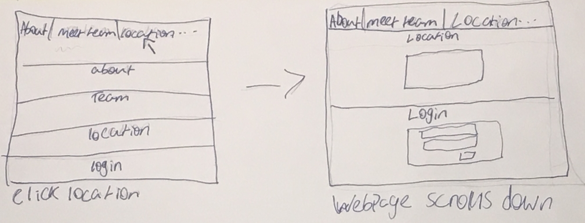
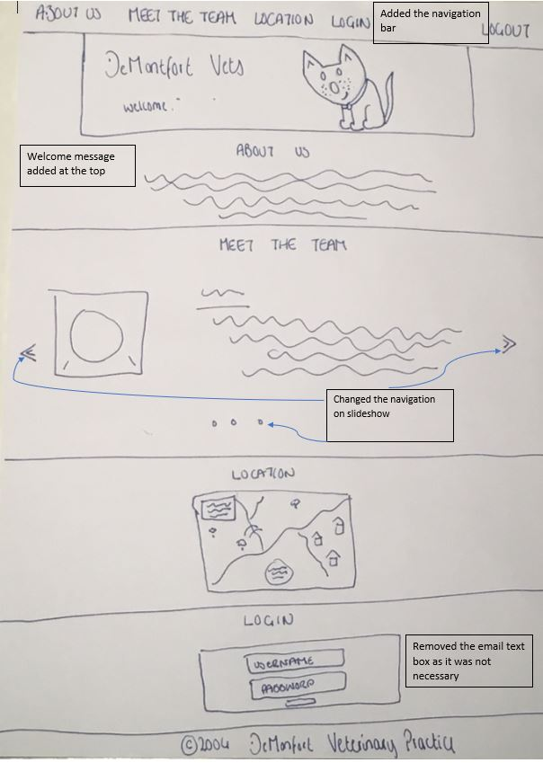
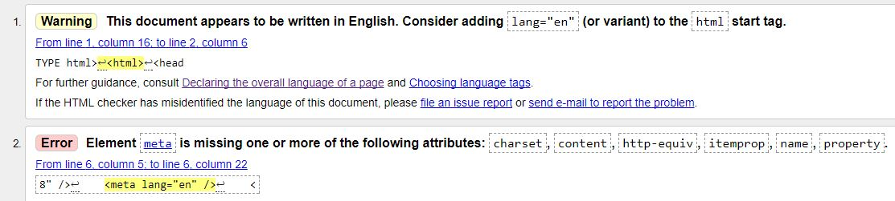
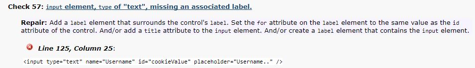

# DeMontfort Vets Website

## Initial Designs
### First Draft
This is the first design of how the page will be layed out and showing that it is intended to be a single page app. More designs will follow as this is only a draft.
Things like the navbar still need to be added.


### Example of single page app functionality
I decided to create a single page app using anchored headings. The webpage will automatically scroll the user down to whichever heading they selected in the navigation bar.
below is an illustration of this from the initial design phase.



### Finalised design
As you can see, this design now has the nav bar at the top with a few other changes described in the image.


## Issues
- **OnClicks** - As the slideshow i have used was adapted from a w3schools tutorial, it still contained some onclicks within the html. 
In order to change these to event listeners i had to create some new functions as it would not allow me to pass a parameter through the event listener. 
An example of this is given below.
#### Before
```javascript
function plusSlides(n) {
	showSlides(slideIndex += n);
}
```
#### After
```javascript
function NextSlide() {
    showSlides(slideIndex += 1);
}

function PreviousSlide() {
    showSlides(slideIndex += -1);
}
```

- **Empty login issue** - There is still currently an issue that occurs when the user attempts to log in without entering any data in the loging form text boxes.
Doing this causes the alert to constantly loop wihtout being able to get out. 
This issue was also raised in the user testing however i have been unable to find a fix for it. 
it is difficult to provide screeshots of this issue in action as it just repeats the same alert message over and over again

## Changes made after user testing feedback
- **Back to Top Button** - After the user testing it became clear that there needed to be a quicker way for the user to get back to the top of the page.
I therefore added a .js function will display a back to top button once the user has scrolled a certain amount down the page. 
below is the code and 2 screenshots showing an example of the function in action.
```javascript
window.onscroll = function () { DisplayToTopButton() };

function DisplayToTopButton() {
    if (document.body.scrollTop > 300 || document.documentElement.scrollTop > 300) {
        document.getElementById("TopBtn").style.display = "block";
    } else {
        document.getElementById("TopBtn").style.display = "none";
    }
}
```
#### Before Scroll

#### After Scroll


- **Hiding login form after user has logged in** - Another point brought forward during the user testing was the fact that the login form was still displayed after the user logged in.
This became comfusing for some users so i added some code to hde the login form. this code is displayed below.
```javascript
document.getElementById('Loginbtn').addEventListener('click', HideLoginForm)
let LoginForm = document.getElementById("LoginForm")
let LoginHeading = document.getElementById("Login")
let NavLogin = document.getElementById("NavLogin")

function HideLoginForm() {
    LoginForm.style.display = "none";
    LoginHeading.style.display = "none";
    NavLogin.style.display = "none";
    checkCookie();
}
```

## Code Checkers

### HTML Validator

The HTML validator returned one warning and one error both related to similar things. these were easy fixes, all i had to do was move the language from the meta tag to the main html tag. 
the changes of code are shown below
#### Before
```HTML
<meta lang="en">
```
#### After
```HTML
<html lang="en">
```

### CSS validator
No errors were found in my CSS!


### HTML Accessibility
The accessiblity checker throws up 7 known problems however these problems are all related to the fact that the text boxes in my login form do not have lables
to explain to the user what data belongs in whihc text box. instead of labels though, i have used placeholders within the text for a simpler look.
below is an example of one of the problems. they are all the same so 7 different screen shots arent necessary.


## References
* https://www.w3schools.com/w3css/w3css_slideshow.asp
* https://www.w3schools.com/howto/howto_js_topnav_responsive.asp
* http://code.stephenmorley.org/javascript/using-cookies/
* https://developers.google.com/maps/
* https://www.w3schools.com/cssref/pr_pos_z-index.asp


