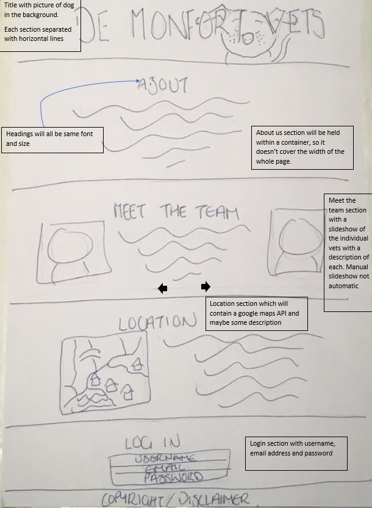
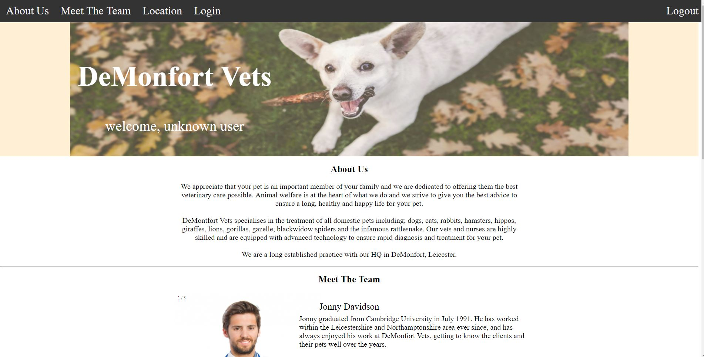
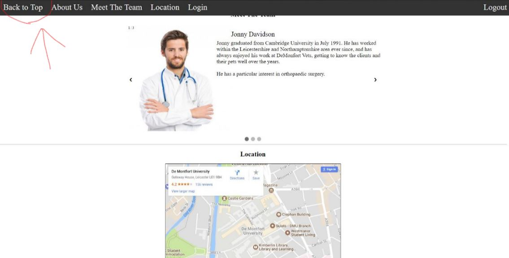

# DeMontfort Vets Website

## Initial Designs and prototype
### First Draft
This is the first design of how the page will be layed out and showing that it is intended to be a single page app. More designs will follow as this is only a draft.
Things like the navbar still need to be added.


### Finalised design
As you can see, this design now has the nav bar at the top with a few other changes described in the image.
![Final Design] (Images/FinalDesign.JPG)

## Issues
- **OnClicks** - As the slideshow i have used was adapted from a w3schools tutorial, it still contained some onclicks within the html. 
In order to change these to event listeners i had to create some new functions as it would not allow me to pass a parameter through the event listener. 
An example of this is given below.
#### Before
```javascript
function plusSlides(n) {
	showSlides(slideIndex += n);
}
```
#### After
```javascript
function NextSlide() {
    showSlides(slideIndex += 1);
}

function PreviousSlide() {
    showSlides(slideIndex += -1);
}
```

## Changes made after user testing feedback
- **Back to Top Button** - After the user testing it became clear that there needed to be a quicker way for the user to get back to the top of the page.
I therefore added a .js function will display a back to top button once the user has scrolled a certain amount down the page. 
below is the code and 2 screenshots showing an example of the function in action.
```javascript
window.onscroll = function () { DisplayToTopButton() };

function DisplayToTopButton() {
    if (document.body.scrollTop > 300 || document.documentElement.scrollTop > 300) {
        document.getElementById("TopBtn").style.display = "block";
    } else {
        document.getElementById("TopBtn").style.display = "none";
    }
}
```

